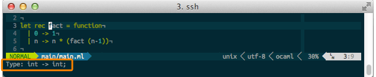

OCamlspot Vim plugin
====================

OCamlspot for Vim allows Vim to get type information from the output of
`ocamlspot`. When installed, Vim can show the type of the OCaml symbol under
the cursor with a keypress.

Screenshot
==========

Requirements
============
The OCamlspot plugin uses the `.cmt` or `.spot` files generated by `ocamlspot`
during compilation. To compile with binary annotation output use the following
flag:

    OCAMLFLAGS+=-bin-annot

Alternatively, you can use a patched OCaml compiler that adds this flag by
default based on an environemnt variable. This compiler can be obtained from
[OPAM](http://opam.ocamlpro.com/).

    opam switch 4.00.1+annot

For more information on which compilers can be used and how to use them, see
the docs for [OCamlSpotter](https://bitbucket.org/camlspotter/ocamlspot).

Installation
============
This plugin is written to be easily installable using [Pathogen](https://github.com/tpope/vim-pathogen):

    cd ~
    git clone http://github.com/simonjbeaumont/vim-ocamlspot.git .vim/bundle/vim-ocamlspot

Pro-tip: if you're keeping your Vim config under Git, consider using Git
submodules for your plugins (works very nicely with Pathogen):

    cd ~/.vim
    git submodule add http://github.com/simonjbeaumont/vim-ocamlspot.git bundle/vim-ocamlspot
    git submodule init
    git submodule update

Usage
=====
The plugin exports a function `OCamlType()` which can be called in Vim to show
the type of the symbol under the cursor.

The functions `OCamlSpot()` and `OCamlSpotSplit()` can be used to jump to the
definition of the symbol under the cursor. `OCamlSpotSplit()` opens the definition
in a new split.

These can be mapped in your `.vimrc`, e.g.:

    map <C-k> :call OCamlType()<CR>
    map <C-]> :call OCamlSpot()<CR>

Still to be done
================
* Write a quick Vim help file under `doc/`;
* Use `ftdetect` to only load this plugin for OCaml files;
* Add default shortcuts.

Contributions are more than welcome for any bugs or improvements, just submit a
pull request.

Acknowledgements
================
Credit to [John Else](http://github.com/johnelse), from whom this repo was
forked and to [Jun Furuse](http://jun.furuse.info/) for the creation of the
plugin and his work with OCamlspotter.
